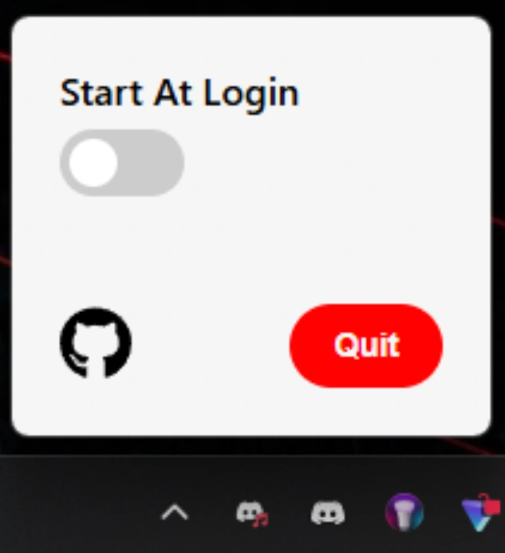
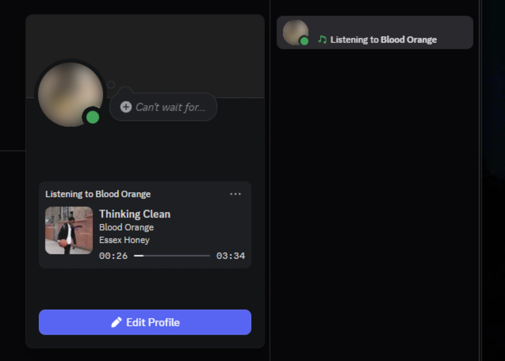

<div align="center">

# 🎵 Apple Music Discord App

A lightweight Tauri application that displays your current Apple Music song on Discord Rich Presence (RPC).

[](https://github.com/tsliger/apple-music-discord-app/actions/workflows/macos-tauri.yml)
[](https://github.com/tsliger/apple-music-discord-app/actions/workflows/windows-tauri.yml)

</div>
<div align="center">
  
  
</div>

## 🚀 Features

-   **Live Updates**: Display your currently playing Apple Music track on Discord in real-time.
-   **Album Art Support**: Album art will be displayed when playing songs.
-   **Autostart**: Option to start app on computer load.
-   **Runs In Background**: App will persist in the background and appear in taskbar.
-   **Lightweight**: Built with Tauri for minimal resource usage.
-   **macOS and Windows Support**: Currently available for macOS and Windows.

## 🛠️ Built With

-   **[Tauri](https://tauri.app/)**: For creating a fast and lightweight desktop app.
-   **[Svelte](https://svelte.dev/)**: As the reactive front-end framework.
-   **[Go](https://go.dev/)**: Manages back end integration between Apple Music and Discord.
-   **Discord RPC API**: To integrate with Discord Rich Presence.

## 📦 Installation

### Prerequisites

-   Bun >= 1.1.29
-   Rust >= 1.84
-   Go >= 1.23.1
-   Discord installed and running.
### Steps

1.  Clone the repository:

    ```bash
    git clone https://github.com/your-username/apple-music-discord-rpc.git
    cd apple-music-discord-rpc
    ```

2.  Install dependencies:
	 ```bash
    bun install
    ```
3.  Build Go dependancies:
	  ```bash
    ./build_dependancies.sh
    ```
5.  Run the app in development mode:

    ```bash
    bun run tauri dev
    ```

6.  Build the app for macOS:

    ```bash
    ./build_dependancies.sh
    bun run tauri build
    ```
## 📖 Usage

1.  Open the app on your macOS device and start playing a track on Apple Music.
2.  Ensure Discord is running with Rich Presence enabled in settings.
3.  Your current track will appear on your Discord profile under the activity section!

## 🤝 Contributing

Contributions are welcome! Feel free to open an issue or submit a pull request.

## 📝 License

This project is licensed under the MIT License.
